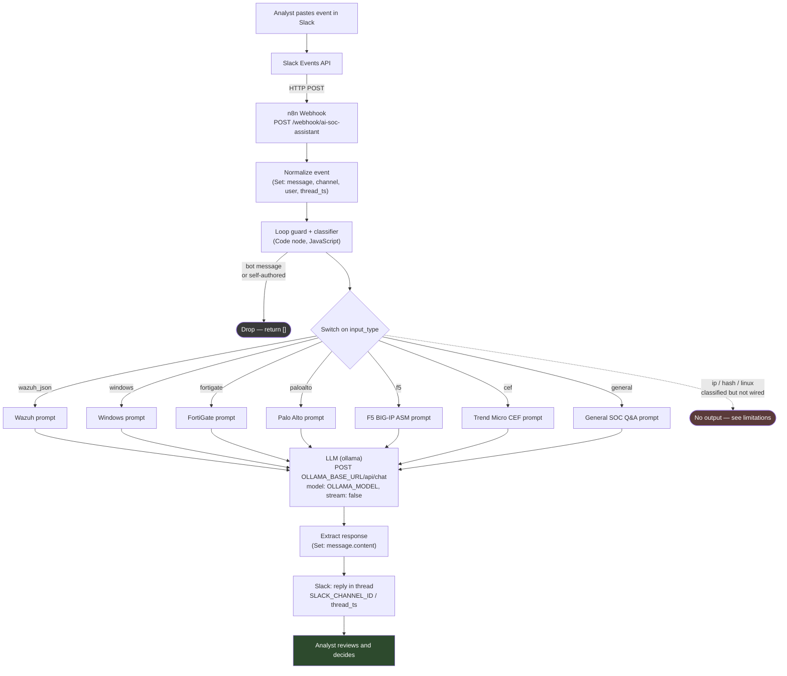

# soc-automation-playbooks

[](https://github.com/your-org/soc-automation-playbooks/actions/workflows/json-validation.yml)
[](https://github.com/your-org/soc-automation-playbooks/actions/workflows/secret-scan.yml)
[](https://github.com/your-org/soc-automation-playbooks/actions/workflows/python-validation.yml)
[](LICENSE)

Reusable SOC automation and SOAR playbooks built with [n8n](https://n8n.io),
published as sanitized, importable exports with the documentation needed to
actually run them.

The stack used to build and run everything implemented here is **n8n + Ollama +
Slack**. Nothing else is deployed.

The first implemented playbook is the **AI SOC Assistant** — an n8n workflow that
takes a security event pasted into Slack, classifies the log source, selects a
source-specific SOC analyst system prompt, sends it to a **locally hosted Ollama
model**, and replies in the Slack thread with a structured analyst-style
assessment.

> **Scope honesty.** This repository documents what is actually implemented:
> one n8n workflow, running against a self-hosted Ollama model, delivering into
> Slack. Threat-intelligence enrichment, deterministic risk scoring and case
> management are **designed and documented but not built** — they are labelled
> `Planned` everywhere they appear.
>
> **Shuffle has not been used in this project.** No Shuffle instance has been
> deployed and no Shuffle workflow has been built. The design notes under
> `workflows/shuffle/planned/` are forward-looking sketches for a SOAR platform
> that is not part of the current stack. See
> [Known limitations](#known-limitations) and [Roadmap](#roadmap).

---

## Table of contents

- [Purpose](#purpose)
- [Architecture](#architecture)
- [Implemented workflows](#implemented-workflows)
- [Platform coverage](#platform-coverage)
- [Workflow stages](#workflow-stages)
- [Supported integrations](#supported-integrations)
- [Repository structure](#repository-structure)
- [Quick start](#quick-start)
- [Configuration](#configuration)
- [Credentials](#credentials)
- [Testing](#testing)
- [Security model](#security-model)
- [AI limitations](#ai-limitations)
- [Human-in-the-loop controls](#human-in-the-loop-controls)
- [Known limitations](#known-limitations)
- [Roadmap](#roadmap)
- [References](#references)
- [License](#license)

---

## Purpose

Tier 1 and Tier 2 SOC work involves a lot of repeated reading: the same firewall
denies, the same Kerberos failures, the same WAF violations, over and over. Most
of that reading is not hard, but it is slow, and it is where fatigue turns into
missed context.

This repository collects automation that removes the mechanical part of that
work while keeping the analyst in charge of the conclusion. The AI SOC Assistant
does not close alerts, does not block anything, and does not write to a case
management system. It reads one event and returns a structured first pass —
verdict, severity, overall risk, confidence, evidence, assessment, recommended
actions, and explicitly, what information is *missing*.

The design goal that shapes every prompt in this repository is **refusal to
over-claim**. The system prompts spend more words on what the model must *not*
conclude than on what it should conclude: a blocked connection is not a
compromise, a MITRE mapping is not proof a technique executed, a high rule level
is not a high risk, and a denied packet is not reconnaissance. When the evidence
does not decide the question, the required answer is *Requires Investigation*.

## Architecture



Source: [`diagrams/architecture.mmd`](diagrams/architecture.mmd). Data flow,
classifier decision logic and stage sequencing are rendered in
[`diagrams/README.md`](diagrams/README.md).

Everything in this diagram is present in the shipped workflow export. The one
dashed path (`ip / hash / linux`) is drawn because the classifier *does* produce
those labels and the Switch *does* have those outputs — but they are not
connected to anything downstream. That is a real property of the workflow, not a
simplification of the drawing.

## Implemented workflows

| Workflow | Platform | Status | Nodes | Trigger | Output |
|---|---|---|---|---|---|
| [AI SOC Assistant](workflows/n8n/ai-soc-assistant/) | n8n | **Implemented** | 14 | Webhook (Slack Events API) | Slack threaded reply |

That is the complete list. One workflow is implemented, and it is the one shipped
in this repository.

## Platform coverage

| | n8n | Shuffle |
|---|---|---|
| Used in this project | **Yes** | **No — never deployed** |
| Implemented exports in repo | 1 (`ai-soc-assistant.sanitized.json`) | 0 |
| Design notes | — | 3 |
| Importable today | Yes, after credential reassignment | n/a |

The Shuffle directory holds **forward-looking design notes only**. No Shuffle
instance was deployed, no Shuffle workflow was built, and no Shuffle export
exists here. If you are evaluating this project, read it as an n8n project with
some notes on where a SOAR platform could fit later — not as a two-platform
project.

The notes were written because the designs are genuinely different from the
implemented workflow: the AI SOC Assistant is analyst-initiated and cannot act,
whereas an alert-initiated SOAR playbook runs on events nobody has looked at
yet. Recording that distinction is useful. Presenting it as delivered work would
not be.

## Workflow stages

These eight stages are the ones present in the shipped export. Each maps to
named nodes — see [`node-reference.md`](workflows/n8n/ai-soc-assistant/node-reference.md)
for the per-node detail.

| # | Stage | Node(s) | What it does |
|---|---|---|---|
| 1 | **Ingest** | `Webhook` | Accepts `POST` on a configurable path. Built for Slack Events API payloads, accepts any JSON body. |
| 2 | **Normalize** | `Detect Input Type` | Lifts `body.event.text`, `.channel`, `.user`, `.ts`/`.thread_ts`, `.type` into flat fields. |
| 3 | **Loop guard** | `Classifier` | Returns `[]` for bot messages, `bot_message` subtype, or the assistant's own user id — prevents the bot answering itself. |
| 4 | **Classify** | `Classifier` | Derives `input_type` from decoder name, rule groups, Windows event data, CEF vendor strings, and text patterns. Ten possible values. |
| 5 | **Route** | `Route Investigation` | Ten outputs keyed on `input_type`. Seven are wired. |
| 6 | **Prompt selection** | the seven prompt nodes | Sets `system_prompt` to a source-specific SOC analyst prompt, passing all other fields through. |
| 7 | **AI analysis** | `LLM (ollama)` | `POST` to the Ollama chat endpoint with `system_prompt` as system message and the raw event as user message, `stream: false`. |
| 8 | **Deliver** | `Compiler` → `Send a message` | Extracts `message.content`, restores the original `channel` and `thread_ts`, posts the reply into the originating Slack thread. |

**Stages that are deliberately *not* in this list**, because they are not in the
workflow: alert aggregation, indicator extraction as a discrete stage,
VirusTotal or AbuseIPDB enrichment, deterministic risk scoring, structured
parsing of the model's reply, and case creation. See
[Known limitations](#known-limitations).

## Supported integrations

| Integration | Role | Status |
|---|---|---|
| Slack (Events API + `chat.postMessage`) | Input channel and output channel | Implemented |
| Ollama (`/api/chat`) | Local LLM inference | Implemented |
| Wazuh | Log source — alerts are pasted as JSON and classified/analyzed | Implemented as an *input format*, not as an API integration |
| Windows Security / Sysmon | Log source via Wazuh JSON or raw text | Implemented (prompt + classifier) |
| Fortinet FortiGate | Log source | Implemented (prompt + classifier) |
| Palo Alto PAN-OS | Log source | Implemented (prompt + classifier) |
| F5 BIG-IP ASM / Advanced WAF | Log source | Implemented (prompt + classifier) |
| Trend Micro (Deep Security, DDI, Apex Central) via CEF | Log source | Implemented (prompt + classifier) |
| Linux / auth.log | Log source | **Classifier only** — route not wired |
| Bare IP address | Log source | **Classifier only** — route not wired |
| File hash | Log source | **Classifier only** — route not wired |
| VirusTotal | IP/hash reputation enrichment | Planned |
| AbuseIPDB | IP reputation enrichment | Planned |
| TheHive / Cortex | Case management and observable analysis | Planned |
| OpenCTI | Threat intelligence correlation | Planned |

Note the distinction in the Wazuh row. The workflow understands Wazuh alert
*documents* — it parses `_source`, `rule.groups`, `decoder.name`, `data.win` —
but it does not call the Wazuh API and Wazuh does not push to it. Events arrive
because a human pasted them into Slack.

## Repository structure

```
soc-automation-playbooks/
├── README.md                  This file
├── SETUP.md                   Personalize + publish your own copy
├── LICENSE                    MIT
├── CHANGELOG.md               Repository-level history
├── CONTRIBUTING.md            How to add a workflow or prompt
├── SECURITY.md                Vulnerability reporting + sanitization rules
├── CODE_OF_CONDUCT.md         Contributor Covenant 2.1
├── .env.example               Every configuration value, documented
│
├── .github/                   CI, issue templates, CODEOWNERS, dependabot
│   └── workflows/             json-validation, markdown-lint, secret-scan,
│                              python-validation
│
├── workflows/
│   ├── n8n/ai-soc-assistant/  The implemented workflow + its full docs
│   └── shuffle/planned/       Design notes only — Shuffle not used, no exports
│
├── examples/
│   ├── inputs/                Synthetic events you can paste into Slack
│   ├── enrichment/            Reference payloads for the planned enrichment
│   └── outputs/               What the workflow returns, plus the normalized
│                              schema target for the planned parser
│
├── docs/                      Architecture, deployment, threat model,
│                              AI safety, secrets, observability, testing, FAQ
│
├── schemas/                   JSON Schema for alerts, normalized events,
│                              enrichment results and triage results
│
├── scripts/                   Validation and sanitization tooling
│                              (sanitize-map.json is git-ignored — its keys
│                              are the sensitive literals themselves)
│
├── diagrams/                  Mermaid sources (rendered in its README)
│
└── assets/screenshots/        Placeholder — see its README before adding images
```

## Quick start

**Prerequisites:** n8n 1.40+, an Ollama host reachable from n8n with a chat
model pulled, and a Slack app with the Events API enabled.

```bash
git clone https://github.com/<your-org>/soc-automation-playbooks.git
cd soc-automation-playbooks
cp .env.example .env        # fill this in — nothing is read from it automatically
```

If you are *publishing your own copy* rather than deploying this one, start with
[`SETUP.md`](SETUP.md) — it covers the placeholder identifiers that must be
replaced before the first push.

1. **Import the workflow.** In n8n: *Workflows → Import from File* →
   `workflows/n8n/ai-soc-assistant/ai-soc-assistant.sanitized.json`.
   It imports inactive, with no valid credential attached. That is intentional.
2. **Replace the four placeholders.** `OLLAMA_BASE_URL`, `OLLAMA_MODEL`,
   `SLACK_BOT_USER_ID`, and the Slack credential. Exact locations are in
   [`configuration.md`](workflows/n8n/ai-soc-assistant/configuration.md).
3. **Attach a Slack credential** to the `Send a message` node — see
   [`credentials.md`](workflows/n8n/ai-soc-assistant/credentials.md).
4. **Activate**, copy the production webhook URL, and register it as the Slack
   app's Event Subscriptions request URL.
5. **Test** by pasting `examples/inputs/wazuh-windows-alert.json` into the
   channel the bot is in. Expected output shape:
   `examples/outputs/slack-triage-message.txt`.

Full walkthrough: [`docs/getting-started.md`](docs/getting-started.md).
Production concerns: [`docs/deployment.md`](docs/deployment.md).

## Configuration

Everything that must change per environment is listed in
[`.env.example`](.env.example) and located node-by-node in
[`configuration.md`](workflows/n8n/ai-soc-assistant/configuration.md).

The four values that block a first run:

| Placeholder | Node | Example |
|---|---|---|
| `OLLAMA_BASE_URL` | `LLM (ollama)` → URL | `http://ollama.example.com:11434` |
| `OLLAMA_MODEL` | `LLM (ollama)` → JSON body `model` | shipped as `qwen3:14b` |
| `SLACK_BOT_USER_ID` | `Classifier` → loop guard | `U0XXXXXXXXX` |
| Slack credential | `Send a message` | your n8n Slack API credential |

The webhook path ships as `ai-soc-assistant`. Change it — a predictable path on
an internet-reachable n8n is an open door to your LLM. See
[`docs/security-model.md`](docs/security-model.md).

## Credentials

One credential is required: a Slack API credential on the `Send a message`
node, needing `chat:write` and the event subscriptions to deliver
`message.channels` (or `message.groups`) to the webhook.

The Ollama call uses **no credential** — it is an unauthenticated `HTTP Request` node calling
a host you control. If your Ollama endpoint is exposed beyond localhost, put
it behind a reverse proxy with authentication and add a header credential;
[`credentials.md`](workflows/n8n/ai-soc-assistant/credentials.md) covers this.

No credential values, credential IDs, tokens, signing secrets, channel IDs or
workspace identifiers exist anywhere in this repository. Enforcement:
[`scripts/scan_sensitive_values.py`](scripts/scan_sensitive_values.py), run on
every push by [`.github/workflows/secret-scan.yml`](.github/workflows/secret-scan.yml).

## Testing

```bash
python3 scripts/validate_json.py           # every .json file parses
python3 scripts/validate_examples.py       # examples conform to schemas/
python3 scripts/scan_sensitive_values.py   # no secrets, private IPs, tokens
```

All three are dependency-free (`jsonschema` is used when present, and a bundled
subset validator is used when it is not). Manual and end-to-end test procedures,
including the six-case regression set, are in
[`testing.md`](workflows/n8n/ai-soc-assistant/testing.md) and
[`docs/testing-strategy.md`](docs/testing-strategy.md).

## Security model

The short version — the long version is [`docs/security-model.md`](docs/security-model.md)
and [`docs/threat-model.md`](docs/threat-model.md).

- **The webhook is unauthenticated.** n8n's Webhook node here has no auth
  configured. Slack request signature verification is **not implemented** in
  this workflow. Anyone who learns the URL can drive your LLM. Mitigate with
  network placement, a reverse proxy that verifies `X-Slack-Signature`, or n8n
  header auth. This is the single most important item in this README.
- **Log data leaves Slack and enters your LLM host.** Because Ollama is
  self-hosted, that data does not leave your network — that is the reason for
  the local-model design. Point `OLLAMA_BASE_URL` at a hosted API and you have
  changed the data protection posture of the whole system.
- **Event text reaches the model as a user message.** Log content is
  attacker-influenced data. Treat prompt injection through log fields as a real
  risk; see [`docs/threat-model.md`](docs/threat-model.md#t4--prompt-injection-via-log-content).
- **The workflow has no write path into security infrastructure.** It cannot
  block, isolate, disable, or close anything. This is a deliberate constraint,
  not an oversight.

## AI limitations

Read [`docs/ai-safety-and-limitations.md`](docs/ai-safety-and-limitations.md)
before letting anyone treat this output as a verdict. In brief:

- **The model can be wrong, confidently.** The output format includes a
  `Confidence` field; that field is the model's self-report, not a measured
  quantity. A confident-sounding wrong answer looks exactly like a correct one.
- **Threat intelligence is supporting evidence, not proof.** No reputation
  score establishes that an event was malicious in your environment.
- **Blocked traffic is not a compromise.** A firewall deny means the connection
  failed. The prompts forbid describing denied traffic as successful
  compromise; the docs repeat it because it is the most common analytic error
  in AI-generated triage.
- **Private IPs and trusted services need context, not assumptions.** RFC 1918
  does not mean trusted; a Microsoft or Cloudflare destination does not mean
  benign.
- **MITRE ATT&CK mappings are added only when observable evidence supports
  them.** A rule carrying a technique mapping is a statement about the rule, not
  about what happened.
- **Rule-ID-only input produces an insufficient-evidence answer.** If you paste
  a rule ID with no event body, there is nothing to analyze; the correct output
  is a request for more data, not a verdict. See
  [`examples/inputs/wazuh-rule-id-only-alert.json`](examples/inputs/wazuh-rule-id-only-alert.json).
- **Automated blocking must never rely on the LLM verdict alone.** Nothing in
  this repository blocks anything, and any future response automation must gate
  on deterministic signals plus analyst approval.

## Human-in-the-loop controls

Four controls keep a human in the decision path. Three are structural — they
hold because of what the workflow *cannot* do:

1. **No response actions exist.** There is no node in this workflow that can
   change the state of any security control. The output is a Slack message.
2. **Output is advisory text in a thread.** It lands next to the analyst's own
   message, in a channel, where colleagues can see and challenge it.
3. **`Requires Investigation` is the mandated default.** Every source-specific
   prompt instructs the model to choose it when evidence is ambiguous, rather
   than guessing a verdict.
4. **A `Missing Information` section is required in every report.** The model
   must state what it would need to raise its confidence — which turns the
   output into a next-step list rather than a conclusion.

Design detail, and the approval gates required before any future response
automation ships: [`docs/human-in-the-loop.md`](docs/human-in-the-loop.md).

## Known limitations

Stated plainly, because they matter more than the feature list:

1. **No threat-intelligence enrichment is implemented.** There is no VirusTotal
   node and no AbuseIPDB node in the workflow. Where the prompts say "and any
   supplied enrichment", nothing currently supplies it.
2. **No deterministic risk score exists.** `Verdict`, `Severity`, `Overall Risk`
   and `Confidence` are produced by the language model as text. There is no
   scoring formula in the workflow to document, and none is claimed. Adding one
   is [roadmap item 3](docs/roadmap.md).
3. **The model's reply is not parsed.** `Compiler` takes
   `message.content` as a string and passes it to Slack. Nothing validates that
   the model followed the required format. Malformed output reaches the analyst
   as-is.
4. **Three classifier routes are dead ends.** `ip`, `hash` and `linux` are
   produced by the Code node and have Switch outputs, but those outputs connect
   to nothing. An input classified as one of them produces **no Slack reply at
   all** — silent failure, not an error message.
5. **No alert aggregation or correlation.** Each message is analyzed in
   isolation. Ten related alerts produce ten unrelated analyses.
6. **No retry, timeout tuning, or error branch.** If Ollama is slow or down, the
   execution fails and the analyst gets silence. There is no error workflow.
7. **The Slack `event_type` field name has a stray `=` prefix.** In
   `Detect Input Type` the field is literally named `=event_type`. It is preserved
   as-is because this repository ships what runs; see
   [`troubleshooting.md`](workflows/n8n/ai-soc-assistant/troubleshooting.md).
8. **No rate limiting or cost control.** A busy channel can queue unbounded
   inference requests.
9. **Verdict vocabulary is not yet normalized.** The deployed prompts emit
   `Malicious | Suspicious | Benign | False Positive | Requires Investigation`.
   The normalized machine vocabulary (`TRUE_POSITIVE`, `FALSE_POSITIVE`,
   `SUSPICIOUS`, `INFORMATIONAL`, `INSUFFICIENT_EVIDENCE`) is defined in
   [`schemas/ai-triage-result.schema.json`](schemas/ai-triage-result.schema.json)
   as the target for the planned parser, with a mapping table in
   [`docs/ai-safety-and-limitations.md`](docs/ai-safety-and-limitations.md#verdict-vocabulary).

## Roadmap

Full detail with acceptance criteria: [`docs/roadmap.md`](docs/roadmap.md).

| Priority | Item | Status |
|---|---|---|
| 1 | Wire the `ip`, `hash` and `linux` Switch outputs | Planned |
| 2 | Structured output parsing + schema validation of the model reply | Planned |
| 3 | Deterministic risk score computed outside the model | Planned |
| 4 | VirusTotal + AbuseIPDB enrichment before inference | Planned |
| 5 | Slack request signature verification | Planned |
| 6 | Error branch, timeout and retry on the inference call | Planned |
| 7 | Alert aggregation / correlation window | Planned |
| 8 | Wazuh → TheHive → Cortex playbook (would require adopting Shuffle) | Planned |
| 9 | TheHive case creation with analyst approval gate | Planned |
| 10 | OpenCTI correlation | Planned |

## References

- [n8n documentation](https://docs.n8n.io/)
- [n8n Webhook node](https://docs.n8n.io/integrations/builtin/core-nodes/n8n-nodes-base.webhook/)
- [Ollama API — `/api/chat`](https://github.com/ollama/ollama/blob/main/docs/api.md)
- [Slack Events API](https://api.slack.com/apis/connections/events-api)
- [Slack — verifying requests](https://api.slack.com/authentication/verifying-requests-from-slack)
- [Wazuh alert fields](https://documentation.wazuh.com/current/user-manual/ruleset/ruleset-xml-syntax/rules.html)
- [MITRE ATT&CK](https://attack.mitre.org/)
- [Shuffle documentation](https://shuffler.io/docs)
- [RFC 5737 — IPv4 address blocks reserved for documentation](https://www.rfc-editor.org/rfc/rfc5737)
- [OWASP Top 10 for LLM Applications](https://owasp.org/www-project-top-10-for-large-language-model-applications/)

## License

[MIT](LICENSE).

The workflow export is provided as a starting point, not a turnkey security
control. You are responsible for reviewing it, configuring it for your
environment, and for every decision made on the basis of its output.
