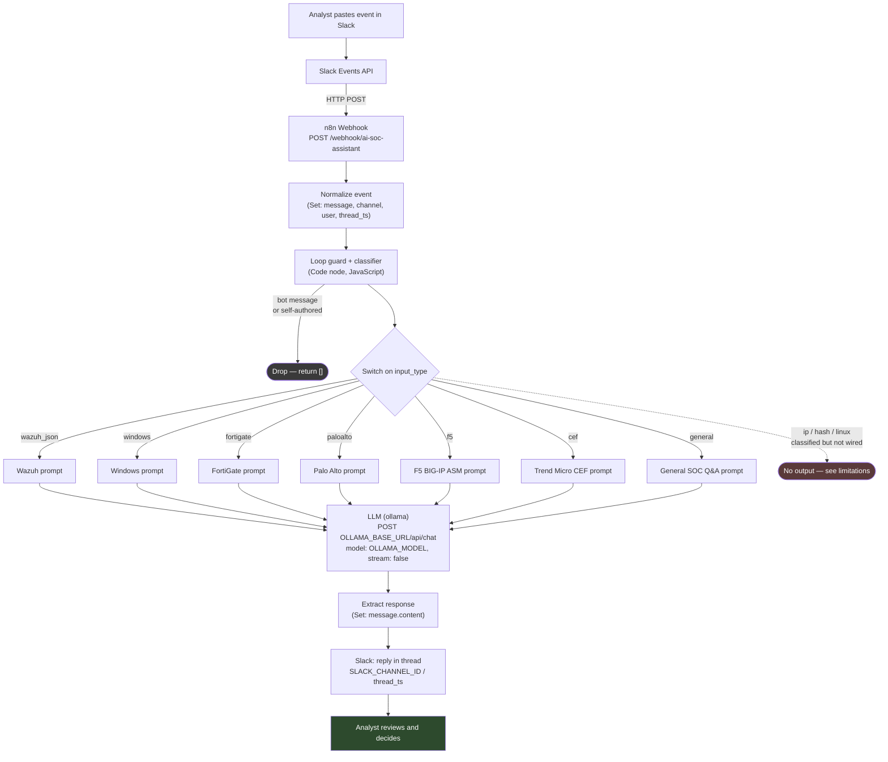
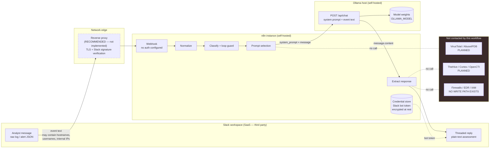
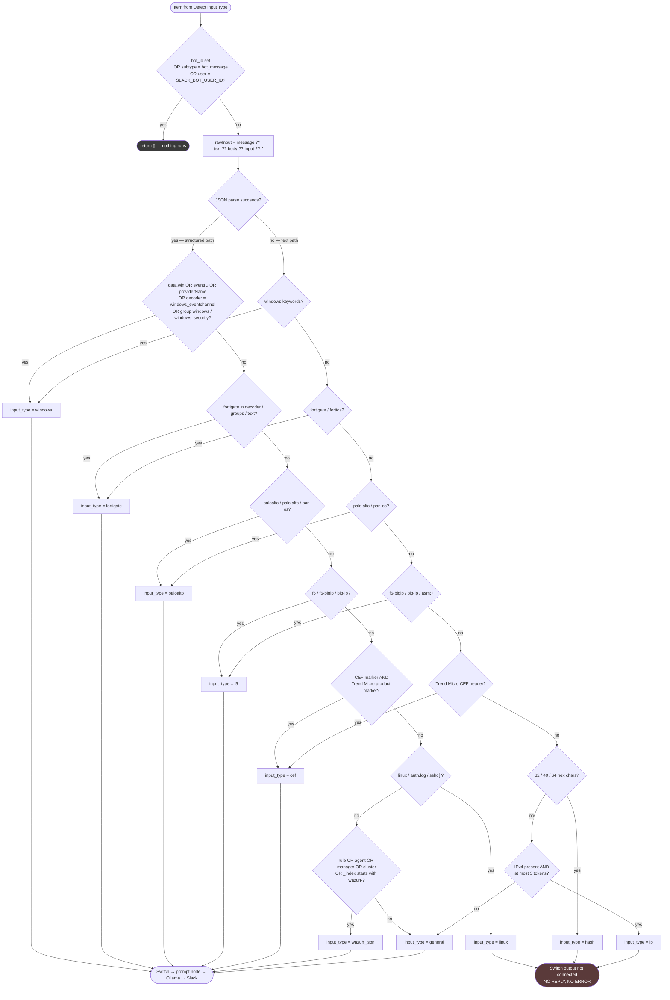
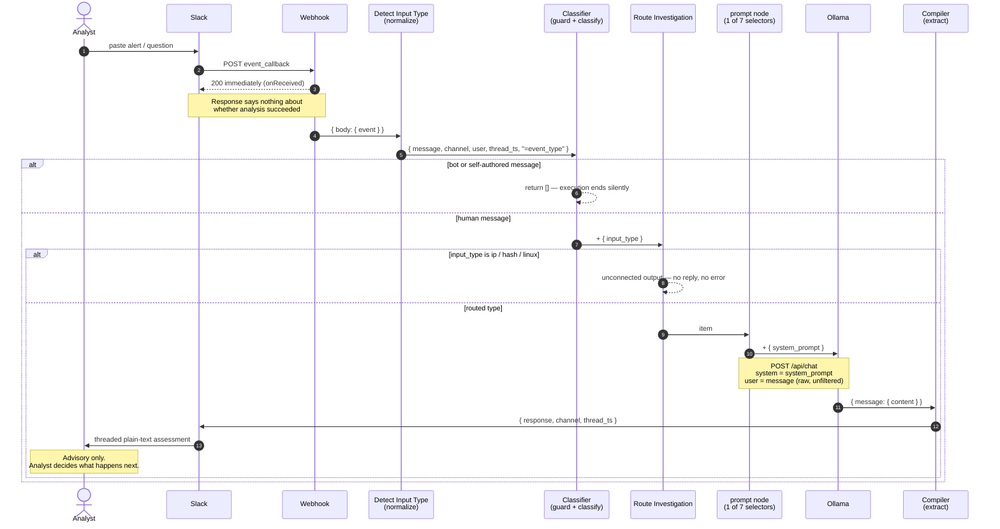

# Diagrams

Mermaid sources for the AI SOC Assistant. Every diagram is derived from
[`../workflows/n8n/ai-soc-assistant/ai-soc-assistant.sanitized.json`](../workflows/n8n/ai-soc-assistant/ai-soc-assistant.sanitized.json)
— nothing here is aspirational. Where a path is drawn as a dead end, it is a
dead end in the workflow.

GitHub does not render a bare `.mmd` file, so each source is embedded below as a
fenced `mermaid` block. Edit the `.mmd` file and paste the change here, or the
two drift apart.

| Source | Shows |
|---|---|
| [`architecture.mmd`](architecture.mmd) | End-to-end component flow |
| [`data-flow.mmd`](data-flow.mmd) | What data crosses which trust boundary — and what is never contacted |
| [`decision-flow.mmd`](decision-flow.mmd) | Classifier logic, in evaluation order |
| [`workflow-stages.mmd`](workflow-stages.mmd) | Stage sequence with the data contract between stages |

---

## Architecture

Solid paths exist in the export. The dashed path is real: `ip`, `hash` and
`linux` are classified, have Switch outputs, and connect to nothing.

---

## Data flow

Note the `Not contacted by this workflow` cluster. Threat-intelligence
enrichment, case management and every security control sit outside the system —
there is no write path to any of them.

---

## Decision flow

This mirrors the Code node exactly, including evaluation order. Order matters:
specific log sources are tested before the generic `wazuh_json` fallback, which
is why a Wazuh document wrapping a FortiGate log reaches the FortiGate analyst
prompt — and also why Wazuh alerts tagged `linux` reach a dead end.

---

## Workflow stages

