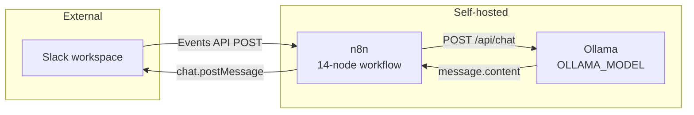

# Architecture

The AI SOC Assistant is a single n8n workflow with three external dependencies:
Slack (input and output), an Ollama host (inference), and nothing else. There is
no database, no queue, no cache, and no integration with any security control.

Full diagram sources: [`../diagrams/`](../diagrams/).

## Components

| Component | Role | Hosted | Failure behaviour |
|---|---|---|---|
| Slack | Analysts submit events; assessments are returned in-thread | SaaS | No input, no output. Nothing queues. |
| n8n Webhook | Entry point, unauthenticated | Self | Returns 200 regardless of downstream outcome |
| Classifier (Code node) | Loop prevention and log-source detection | Self | Misclassification routes to the wrong prompt, or to a dead end |
| Route Investigation (Switch) | Routes on `input_type` | Self | Three outputs unconnected — silent drop |
| Prompt nodes (7) | Attach a source-specific system prompt | Self | n/a — pure assignment |
| Ollama | Inference | Self | Execution fails, analyst gets silence |
| Slack node | Delivery | Self | Message lost; error visible only in the n8n execution log |

## Design decisions worth understanding

### Local inference is the point, not an optimisation

Security telemetry contains internal hostnames, usernames, private addressing,
and often the shape of a live incident. Sending that to a hosted inference API
exports it to a third party. Ollama on infrastructure you control keeps the data
inside the same trust boundary as the SIEM that produced it.

This is the single most consequential architectural choice in the project, and
it is also the easiest to undo by accident: changing `OLLAMA_BASE_URL` to a
hosted endpoint changes the data protection posture of the whole system without
changing a single line of logic. Treat that value as a control, not a setting.

### Prompt-per-source instead of one general prompt

A single "analyse this security event" prompt produces generic output. The seven
prompts here encode source-specific knowledge — FortiGate NAT semantics, F5 ASM
alerted-versus-blocked, Kerberos failure codes, CEF product identification — and
the source-specific *failure modes* an analyst should not fall into.

The cost is maintenance: seven prompts drift independently, and the classifier
must keep routing correctly for any of them to matter. The classifier is
therefore the highest-risk component in the system despite being the simplest.

### Classification order is load-bearing

Specific log sources are tested before the generic `wazuh_json` fallback. A
Wazuh alert wrapping a FortiGate log matches both; testing FortiGate first sends
it to the analyst prompt that understands `policyid`, `action=deny` and session
counters.

The same ordering produces the workflow's worst current behaviour: Wazuh alerts
whose rule groups include `linux` are classified `linux`, which is a dead-end
route, so they disappear silently. See [Known limitations](#known-limitations).

### Stateless by construction

Every message is analysed alone. There is no correlation window, no case, no
memory of the previous alert. This keeps the workflow simple and auditable, and
it is also why the system cannot see a campaign — ten related alerts produce ten
unrelated analyses.

### No write path to security controls

The workflow's only outbound write is a Slack message. It cannot block an IP,
isolate a host, disable an account or close an alert. This is a structural
control, not a policy: there is no node to misconfigure. See
[`human-in-the-loop.md`](human-in-the-loop.md).

## What is not in the architecture

Documented explicitly because the absence is easy to miss:

| Absent | Consequence |
|---|---|
| Threat-intelligence enrichment | The prompts say "and any supplied enrichment". Nothing supplies it. |
| Deterministic risk scoring | Verdict, severity, risk and confidence are model text, not computed values. |
| Response parsing / validation | Malformed model output reaches the analyst verbatim. |
| Alert aggregation | No correlation across messages. |
| Retry, timeout, error branch | Inference failure produces silence. |
| Request authentication | The webhook accepts anything that reaches it. |
| Rate limiting | A busy channel queues unbounded inference. |
| Persistence | n8n execution history only. |

## Known limitations

`ip`, `hash` and `linux` are classified, have Switch outputs, and connect to
nothing. Items routed there end a successful execution with no reply and no
error. This is visible on the canvas as unconnected `+` handles on Switch
outputs 0, 1 and 4.

## Scaling

The bottleneck is inference, not n8n. A 14B model answering the ~31 KB Palo Alto
prompt takes tens of seconds. Concurrency is bounded by GPU memory and by
`N8N_CONCURRENCY_PRODUCTION_LIMIT`. Before deploying to a busy channel, measure
single-request latency at your largest prompt and decide what queue depth is
acceptable — an assessment that arrives after the analyst has already decided is
worse than none, because it invites second-guessing a closed decision.
