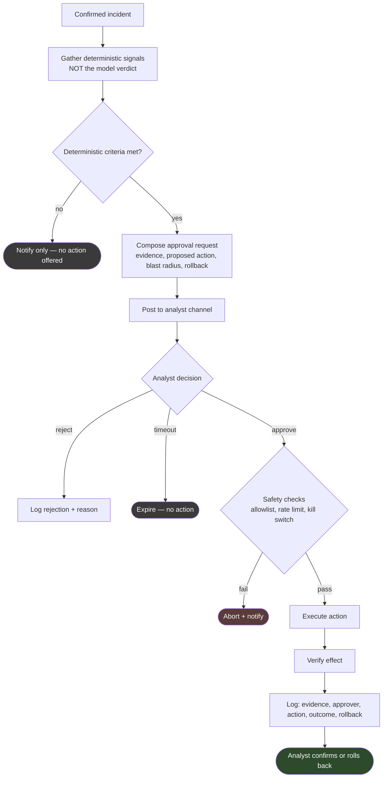

# Automated response (Planned)

> **PLANNED — NOT IMPLEMENTED.** No Shuffle workflow exists. **Nothing in this
> repository can block, isolate, disable or close anything.** That is a
> deliberate constraint, not a gap waiting to be filled carelessly.
>
> **Shuffle is not used in this project** — no instance is deployed. This is a
> design note for a platform the project has not adopted.

## Read this before designing anything here

This is the most dangerous item in the repository. A containment playbook that
misfires denies access to legitimate users, isolates production systems, or
locks out the account someone needs to respond to the incident.

Two documented threats combine badly here:

- **T4, prompt injection.** An attacker who controls a log field can influence
  what the model concludes.
- **T5, over-trust.** A confident, fluent, wrong assessment is
  indistinguishable from a correct one.

Automate containment on a model verdict and you have built a mechanism where an
attacker chooses what your firewall blocks. Analyst approval is what breaks that
chain, and it is not optional.

## Non-negotiable requirements

From [`../../../docs/human-in-the-loop.md`](../../../docs/human-in-the-loop.md):

| Requirement | Why |
|---|---|
| No action on model verdict alone | Verdicts are generated text |
| Explicit approval for consequential actions | A named human owns the decision |
| Approval must present the evidence | "Block this? [Yes]" trains reflex clicking |
| Reversibility documented before the action ships | You will need to undo it |
| Full audit trail | Event, model output, deterministic signals, approver, time, outcome |
| Fail closed | Approval unavailable → no action |
| Rate limits on actions | Bounded blast radius |
| Kill switch | One control that halts all response, tested |

## Intended flow

Note where the model is not: nowhere in the decision path. Its assessment may
appear in the approval request as context for the human. It never satisfies a
criterion.

## Candidate actions

| Action | Reversible | Blast radius | Gate |
|---|---|---|---|
| Comment on a case | Yes | None | None needed |
| Tag an alert | Yes | None | None needed |
| Gather read-only context | Yes | None | None needed |
| Open a low-priority ticket | Yes | None | None needed |
| Block an external IP at the perimeter | Yes | Medium | **Approval** |
| Isolate a host | Yes, disruptive | High | **Approval** |
| Disable an account | Yes | High | **Approval** |
| Quarantine a file | Yes | Low | **Approval** |
| Kill a process | No | Medium | **Approval** |
| Close an alert or case | — | — | **Never automated** |

Blocking an internal address should be treated as out of scope entirely. The
failure mode is denying your own network to itself during an incident.

## Safety mechanisms

**Never-block allowlist.** Domain controllers, DNS, DHCP, NTP, the SIEM,
security tooling, EDR management, jump hosts, and the automation instances
themselves. Checked before execution, not before proposal.

**Rate limits.** A per-hour ceiling on actions, and a global halt if it trips —
a bug that proposes ten blocks is a bug; one that executes a hundred is an
outage.

**Time-boxed actions.** Blocks expire automatically unless renewed, so a
forgotten temporary rule does not become permanent infrastructure.

**Tested kill switch.** One control halting all response. Untested means
non-existent.

**Rollback ships first.** The undo procedure is written and tested before the
action is enabled.

## Approval design

The gate fails in a specific, predictable way: it becomes a reflex click.

- **Gate rarely.** Frequent approvals are not reviewed.
- **Show the evidence**, the proposed action, the blast radius and the rollback
  in the request itself.
- **Make rejection as easy as approval**, and record the reason — rejections are
  the best available signal about where the model and criteria are wrong.
- **Timeouts expire to no-action.** An approval that auto-approves after an hour
  is not a control.
- **Name the approver** in the audit record.

## Prerequisites

| Requirement | Status |
|---|---|
| Shuffle instance | Not deployed |
| Firewall / EDR / IAM API access | Not configured |
| Deterministic risk scoring | Not implemented — [roadmap item 3](../../../docs/roadmap.md) |
| Approval gate mechanism | Not built |
| Allowlist | Not defined |
| Rollback procedures | Not written |
| Audit logging | Not built |
| Organisational sign-off | Not obtained |

## Open questions

- Who is authorised to approve, and what happens outside business hours?
- What deterministic criteria are strong enough to justify offering containment
  at all?
- How is a wrongly-blocked business-critical service detected and reverted?
- What is the escalation path when the kill switch is used?

## Acceptance criteria

Every item under [Non-negotiable requirements](#non-negotiable-requirements),
demonstrated in a test environment, plus a documented rollback for every action,
plus explicit organisational sign-off. Absent any one of these, this stays
`Planned`.
