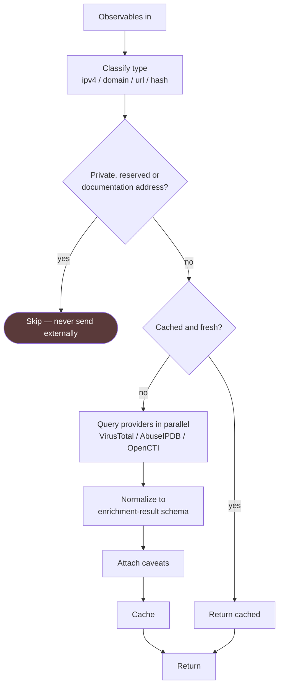

# Threat intelligence enrichment (Planned)

> **PLANNED — NOT IMPLEMENTED.** No Shuffle workflow exists. No VirusTotal,
> AbuseIPDB or OpenCTI integration exists anywhere in this repository, including
> in the implemented n8n workflow.
>
> **Shuffle is not used in this project** — no instance is deployed. This is a
> design note for a platform the project has not adopted.

## Problem

The implemented workflow analyses events with no external context. Its prompts
refer to "any supplied enrichment"; nothing supplies it.

This design covers a reusable enrichment service: give it observables, get back
normalized reputation data with caveats attached.

## Intended flow

## Design decisions

**Private addresses are never sent externally.** RFC 1918, loopback, link-local,
reserved and RFC 5737 documentation ranges are filtered before any provider
call. Sending internal addressing to a third-party reputation service leaks your
network structure and returns nothing useful. This is the first check in the
flow for a reason.

**Normalize, do not pass through.** Providers disagree about scales, field names
and what "malicious" means. Consumers should see one shape —
[`../../../schemas/enrichment-result.schema.json`](../../../schemas/enrichment-result.schema.json) —
not three provider dialects.

**Caveats are part of the result, not documentation.** The schema carries a
`caveats` array because the qualifications matter as much as the score: low
consensus, stale reporting, shared hosting, CDN infrastructure. A score without
its caveats invites exactly the over-trust this repository spends its documentation
warning about.

**Absence is reported as absence.** `found: false` means the provider had no
record. It does not mean clean, and the field name should make that hard to
misread.

**Cache aggressively.** Reputation changes slowly; rate limits and cost do not.
A shared cache across playbooks is the point of building this as a service.

**Failure degrades, never blocks.** If a provider is down, the enrichment result
says so and the investigation continues without it.

## How the implemented workflow would consume this

Enrichment results would be appended to the user message as clearly delimited
supporting evidence, with caveats included, before inference. The prompts
already handle this correctly in principle — they instruct the model to treat
threat intelligence as supporting evidence rather than proof, and to avoid
recommending investigation of large public infrastructure providers.

Two risks to design against:

**Enrichment becomes the verdict.** A model that sees `reputation: MALICIOUS`
will be strongly pulled toward a malicious conclusion regardless of what the
event shows. The caveats must travel with the score, and the prompt must
continue to require that the verdict follow the observable evidence.

**Enrichment widens the injection surface.** Provider responses contain
attacker-influenceable free text — comments, tags, hostnames. That text would
reach the model. It must be delimited and treated as untrusted, exactly like the
event itself.

## Prerequisites

| Requirement | Status |
|---|---|
| Shuffle instance | Not deployed |
| VirusTotal API key | Not configured |
| AbuseIPDB API key | Not configured |
| OpenCTI instance | Not deployed |
| Cache backend | Not designed |
| Indicator extraction | Not written |

## Acceptance criteria

- Observables classified by type.
- Private, reserved and documentation ranges filtered before any external call,
  with a test proving it.
- Providers queried in parallel with per-provider timeouts.
- Results normalized to the schema and validated against it.
- Caveats populated for low consensus, stale data and hosting/CDN ranges.
- `found: false` distinguishable from a clean verdict by consumers.
- Cache with a documented TTL.
- Provider failure degrades gracefully.
- No API key in any export, log or example.
