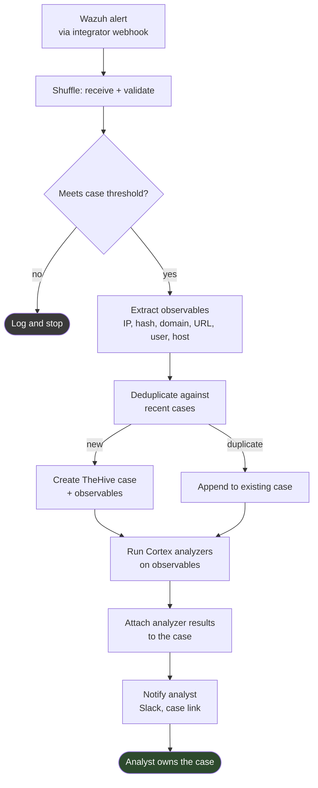

# Wazuh → TheHive → Cortex (Planned)

> **PLANNED — NOT IMPLEMENTED.** No Shuffle workflow exists. No TheHive or
> Cortex instance is integrated. Nothing described here runs.
>
> **Shuffle is not used in this project** — no instance is deployed. This is a
> design note for a platform the project has not adopted.

## Problem

The implemented AI SOC Assistant is analyst-initiated and stateless: someone
pastes an event, gets an assessment, and nothing is recorded outside Slack. That
works as a reading aid and fails as a process — there is no case, no ownership,
no history and no audit trail.

This design covers the alert-initiated path: an alert fires, a case is created,
observables are analyzed, and an analyst is notified with the analysis already
attached.

## Intended flow

## Design decisions

**Case threshold, not every alert.** A case per alert produces a queue nobody
reads. The threshold should combine rule level with asset criticality, and
should be tunable without editing the playbook.

**Deduplication before creation.** Ten alerts from one incident must become one
case with ten observations. Without this, the playbook manufactures the alert
fatigue it was built to reduce.

**Cortex analyzers are enrichment, not verdicts.** Analyzer output attaches to
the case as evidence. It does not set severity, and it does not close anything.

**No case closure, ever.** The playbook may create and enrich. Closing a case is
an analyst decision.

**Private observables are never sent externally.** RFC 1918, reserved and
documentation addresses must be filtered before any external analyzer runs. This
is a data-leakage control.

## Integration with the implemented workflow

The natural join is at notification: the Slack message announcing a new case
could include the AI SOC Assistant's assessment of the triggering alert.

That would require the assessment to be produced without a human pasting
anything, which changes its status from advisory-because-a-human-asked to
advisory-attached-to-a-record. The distinction matters — an assessment sitting
in a case field acquires more authority than one in a chat thread. If this is
built, the case field must be labelled as machine-generated and unreviewed.

## Prerequisites

| Requirement | Status |
|---|---|
| Shuffle instance | Not deployed |
| TheHive instance and API credential | Not deployed |
| Cortex instance with analyzers configured | Not deployed |
| Wazuh integrator configured to push to Shuffle | Not configured |
| Observable extraction logic | Not written |
| Deduplication strategy | Not designed in detail |

## Open questions

- What case threshold avoids both flooding and missing real incidents?
- How long is the deduplication window, and what key identifies "the same
  incident"?
- Which Cortex analyzers, and what happens when one times out?
- Who owns a case created at 03:00 with nobody on shift?
- Does creating a case count as a consequential action requiring an approval
  gate? A case is reversible and low-impact, so probably not — but it is the
  first write into security infrastructure and deserves an explicit decision
  rather than an assumption.

## Acceptance criteria

- Alert received, validated, threshold applied.
- Observables extracted, private ranges filtered.
- Deduplication demonstrably collapses a multi-alert incident into one case.
- Case created with observables attached.
- Analyzers run; failures degrade gracefully rather than failing the playbook.
- Analyst notified with a working case link.
- No closure, no blocking, no containment anywhere in the playbook.
- Sanitized export, full documentation set, synthetic examples.
